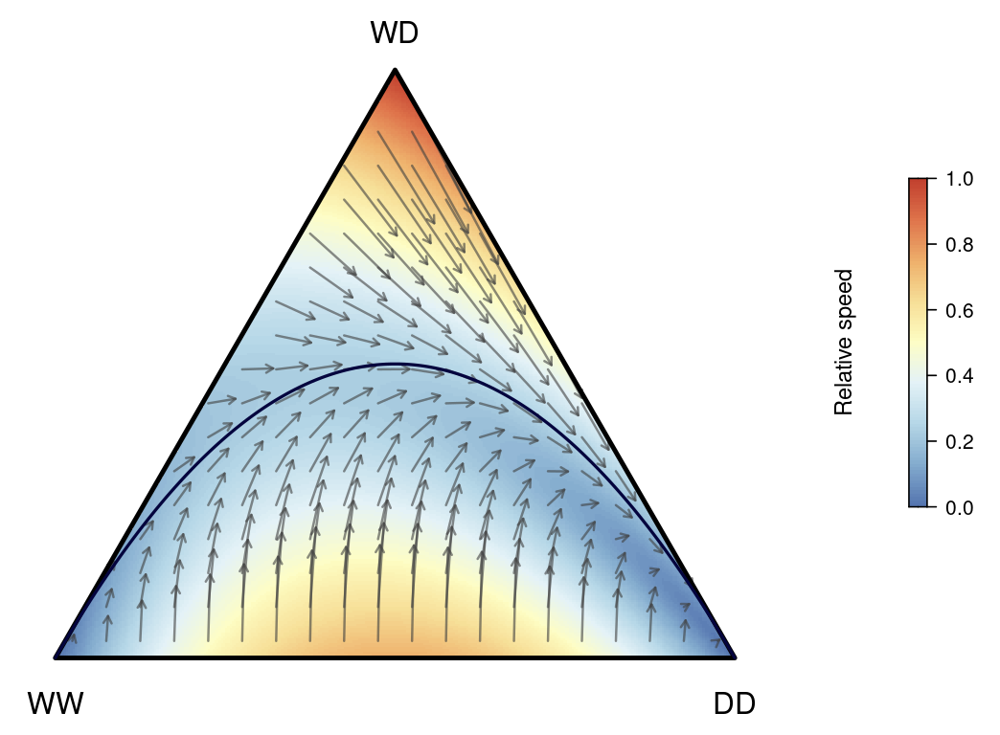
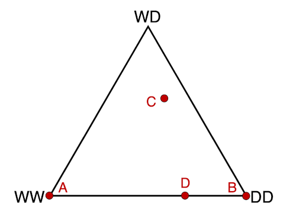
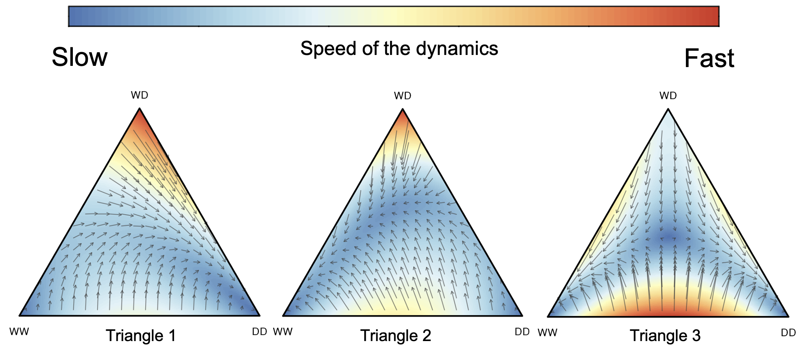
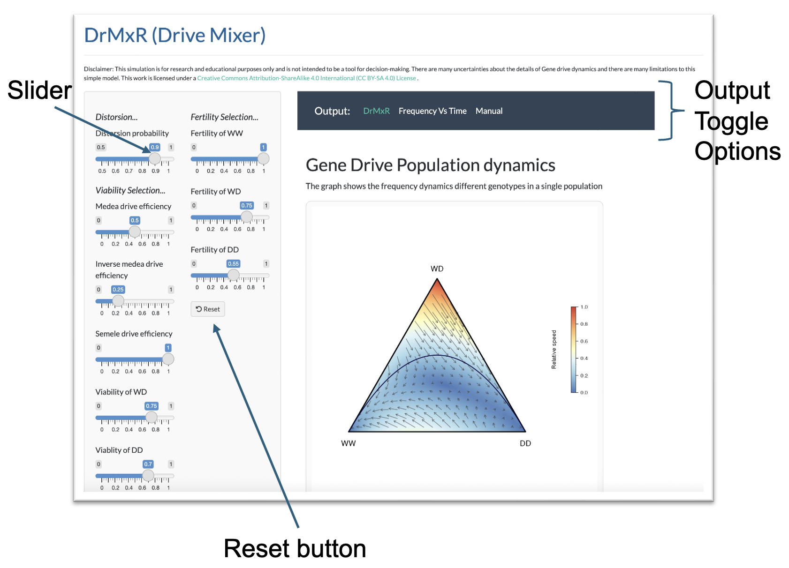
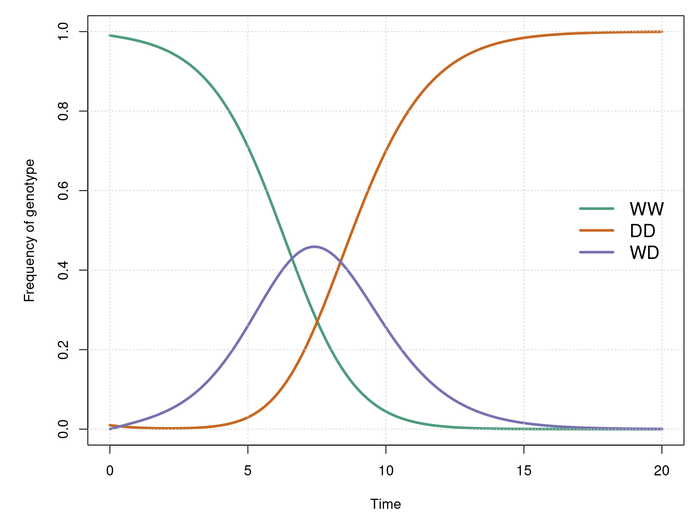

# About

This repository hosts the codes of the synthetic gene drive project in collaboration with R. Guy Reeves and spearheaded by Prateek Verma. 

The model is part of the R&D project “Risk assessment of synthetic gene-drive applications” (FKZ 3518 84 0500) supported by the Federal Agency for Nature Conservation (BfN) with funds from the German Federal Ministry for the Environment, Nature Conservation and Nuclear Safety. The work also has been supported by funds of the Max Planck Society.
***

# Introduction to framework and vocabulary 

Gene drive is a natural phenomena described in a variety of species including mice, flies and beetles ([1928](https://www.genetics.org/content/13/6/488.article-info)). Where it occurs the frequency of a driving gene in a natural population cannot be predicted solely from its Darwinian natural selection parameters, as it can be for most other genes. Additional factors not generally considered in most population genetic models also need to be incorporated ([1978](https://europepmc.org/article/pmc/pmc1213827)). This can make predicting the expected dynamics of gene drives very complicated, even for experts. 
Given the current interest in synthetic gene drive (ones engineered in labs) we wrote `DrMxR` (pronounced drive mixer) to provide an intuitive tool to learn about and evaluate the properties of a very wide range of conceivable drive approaches.

## Synthetic gene drive

Synthetic gene drive has been proposed as a way to push genes in to wild populations ([1998](https://academic.oup.com/bmb/article/54/2/311/284949)). This occurs after individuals carrying the gene drive are released  in to wild populations or arrive from adjacent populations where the gene drive was already present. Currently, no gene drive elements have been released into wild populations.

Despite there being a large number of proposed gene drive systems they all have one of two distinct aims:- 

- To drive a synthetic gene into a target wild population (without the aim of changing the population size). Such a gene could reduce the capacity of mosquitoes to spread diseases like malaria.

OR

- To drive a synthetic gene into a wild target population that has been engineered to reduce the size of the wild population (usually by making fertile females less frequent).

It is important to understand that gene drive works through mating and inheritance between generations and is in no way an infection like process. It can only work within populations of inter-fertile individuals, usually within the same species, (or with less frequency among inter-fertile species).

## DrMxR manual

For a more complete description of ``DrMxR`` please go to our published paper [here](https://bmcecolevol.biomedcentral.com/articles/10.1186/s12862-021-01881-y).

The key to DrMxR is the **triangle diagram** and being able to interpret it (its correct name is a [**de Finetti diagram**](https://en.wikipedia.org/wiki/De_Finetti_diagram)). It provides an overview of what is likely to happen to a single population starting from all possible staring points if you wait enough generations.

As individuals have pair of chromosomes, then all individuals in a population must be one of three genotypes.

1. WW 	wildtype homoyzgote
2. WD 	drive heterozygote 
3. DD 	drive homozygote 

Consequently any population can be fully described by the frequency of each of the above three genotypes, and point on the triangle identifies the relative frequency of the  above 3 genotypes. 

The triangle represents all conceivable populations frequencies where you have a drive allele (D) and a corresponding wildtype allele (W).

The corners represent populations  with 100% one of the three genotypes. All other space represents mixtures of more than one of the three genotypes.

The positions representing the four hypothetical populations are shown in the figure below.

<table>
  <thead>
    <tr>
      <th>Genotype</th>
      <th>Population A</th>
      <th>Population B</th>
      <th>Population C</th>
      <th>Population D</th>
    </tr>
  </thead>
  <tbody>
    <tr>
      <td><strong>WW</strong></td>
      <td>100%</td>
      <td>0%</td>
      <td>15%</td>
      <td>70%</td>
    </tr>
    <tr>
      <td><strong>WD</strong></td>
      <td>0%</td>
      <td>0%</td>
      <td>50%</td>
      <td>0%</td>
    </tr>
    <tr>
      <td><strong>DD</strong></td>
      <td>0%</td>
      <td>100%</td>
      <td>35%</td>
      <td>30%</td>
    </tr>
    <tr>
      <td></td>
      <td><em>All wildtype; no drive present</em></td>
      <td><em>All drive homozygotes; WW extinct</em></td>
      <td><em>All three genotypes coexist</em></td>
      <td><em>Mix of wildtype and drive homozygotes; early spread</em></td>
    </tr>
  </tbody>
</table>

### How to read the figure

**Interior of the triangle.** Each point on the triangle identifies the relative frequency of the three genotypes. The corners represent 100% of just one of the three genotypes. The interior represents mixtures of more than one of the three genotypes

<!--{no arrows no colour , genotypes on corners. mark populations A-D and }-->

**The arrows** you see inside the triangle indicate the probable direction of any genotype frequency change if you wait enough generations. So start at any location(s) in the triangle and follow the arrows to see  the where you probably end up. For example, in these three diagrams.

*Triangle 1*  regardless of what population frequency you start at the DD genotype will tend to increase and if you wait for enough generations all WD and WW genotypes will be eliminated - this can be thought of successful gene drive / population replacement.

*Triangle 2* regardless of what population frequency you start at the WW genotype will tend to increase and if you wait for enough generations all WD and DD genotypes will be eliminated - this can be thought of as a return to a wild population or drive reversal.

*Triangle 3* If you start from a point on the triangle where WW individuals are more frequent than DD individuals (the left side of the triangle),  then WD and DD genotypes will be eliminated. However, if you start from a point on the triangle where WW individuals are less frequent than DD individuals (the right side of the triangle) then WD and WW genotypes will be eliminated.

**The colours** inside the triangle indicate the relative speed of frequency change over generations in the directions indicated by the arrows. We have included them as they can be helpful to some users. While the direction of the arrows can be meaningfully compared between all triangle diagrams generated, this is not the case for the colours.

**The sliders** To make it easier to explore different scenarios ``DrMxR`` has been set up with sliders through which users can mix gene drive parameters.

You can move them around and see how the triangle diagram changes.
If you want more options press the plus symbol on the right of each slider. This includes the capacity to type in numerical values. Hold the mouse over other options to see a description popup.
The big reset button at the bottom of the panel returns all the sliders to their default position of *no-drive*.
Note that the default position of some slider is on the left and some is on the right. Also that while 
all other sliders range from 0-1, *Drive efficiency, p* has a theoretical minimum value of 0.5 (equal segregation) and a max of 1.

**The parameters**, the key insight of the ``DrMxR`` approach is that fact that drive parameters previously in earlier works, using a variety of names and approaches can be considered as representing one of three factors ([as described in the full paper](https://bmcecolevol.biomedcentral.com/articles/10.1186/s12862-021-01881-y)). These are the section headings in the ``DrMxR`` window : distortion, viability and fertility selection 

While ``DrMxR`` allows you to seamlessly mix parameters that may have previously have been viewed as coming from distinct drive systems, it is important to note ``DrMxR`` always presents the results for a single combination drive construct.

**Parameter Description**

<table class="tg">
  <tr>
    <th class="tg-umgj">Parameters</th>
    <th class="tg-umgj">Description</th>
  </tr>
  <tr>
    <td class="tg-7z5x" colspan="2"><i>Viability Selection</i></td>
  </tr>
  <tr>
    <td class="tg-zd5i"><i>&omega;</i></td>
    <td class="tg-zd5i">Probability of survival of the zygotes up-to-the adult stage of genotype WD.</td>
  </tr>
  <tr>
    <td class="tg-zd5i"><i>&nu;</i></td>
    <td class="tg-zd5i">Probability of survival of the zygotes up-to-the adult stage of genotype DD.</td>
  </tr>
  <tr>
    <td class="tg-zd5i"><i>dm</i></td>
    <td class="tg-zd5i">Efficiency of Medea gene drive.</td>
  </tr>
  <tr>
    <td class="tg-zd5i"><i>dim</i></td>
    <td class="tg-zd5i">Efficiency of Inverse Medea gene drive.</td>
  </tr>
  <tr>
    <td class="tg-zd5i"><i>ds</i></td>
    <td class="tg-zd5i">Efficiency of Inverse Semele gene drive.</td>
  </tr>
  <tr>
    <td class="tg-7z5x" colspan="2"><i>Fertility Selection</i></td>
  </tr>
  <tr>
    <td class="tg-zd5i"><i>fWW</i></td>
    <td class="tg-zd5i">Fertility fitness component arising from mating success for genotype WW.</td>
  </tr>
  <tr>
    <td class="tg-zd5i"><i>fWD</i></td>
    <td class="tg-zd5i">Fertility fitness component of genotype WD.</td>
  </tr>
  <tr>
    <td class="tg-0lax"><i>fDD</i></td>
    <td class="tg-0lax">Fertility fitness component of genotype DD.</td>
  </tr>
  <tr>
    <td class="tg-8zwo" colspan="2"><i>Distorsion</i></td>
  </tr>
  <tr>
    <td class="tg-0lax"><i>p</i></td>
    <td class="tg-0lax">The probability of transmission of a drive allele from heterozygous parents to offsprings</td>
  </tr>
</table>

**Technical notes** this is probably a bit technical for most users but currently ``DrMxR`` is focused on a particular class of gene drive systems 

* It does not incorporate the impact of random events (it assumes a large population).
* It assumes that both sexes are equivalent in all ways and that the sex ratio is equal.
* Only a single drive construct is modelled (this is the case even when you mix different drive systems).
* The drive construct is on an autosome (i.e. it is not on chromosomes that are specific to particular sex)
* Diploid chromosomes (no endosymbionts).
* The organism in question can only reproduce sexually. 
* The model allows for overlapping generations.

### Frequency vs. Time Plot

In addition to the triangle (de Finetti) diagram that visualizes long-term gene drive outcomes for all starting conditions, **DrMxR** also provides a traditional plot to examine the dynamics of a single user-defined starting population over time.

This **Frequency vs. Time** plot shows how the frequencies of the three genotypes — **WW** (wildtype), **WD** (heterozygote), and **DD** (drive homozygote) — change over generations, given a specific initial composition and the gene drive parameters selected using the sliders.

- Users can specify the **initial frequency** of WW and DD. The frequency of WD is automatically calculated as `1 - freq_WW - freq_DD`.
- The **time interval** (number of generations to simulate) can be adjusted using a slider.
- The plot provides a temporal view of the gene drive’s trajectory, offering complementary insight to the triangle diagram, which summarizes asymptotic outcomes.

This feature is especially helpful for simulating outcomes from particular starting conditions, such as the expected genotype trajectory after a release or migration event.

---
